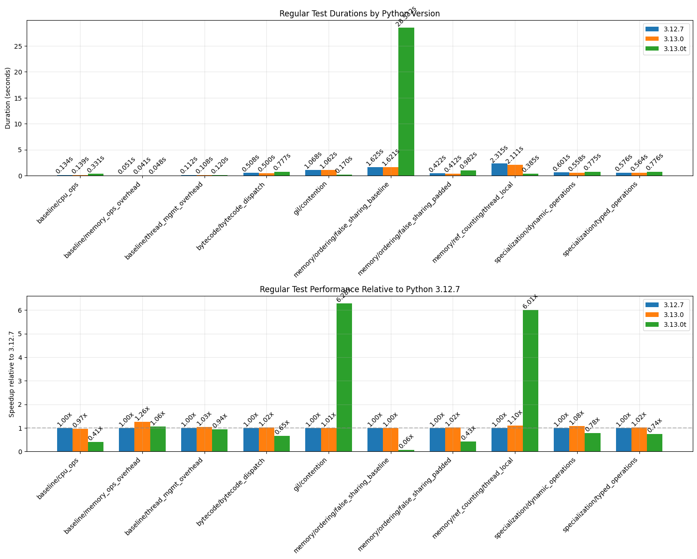
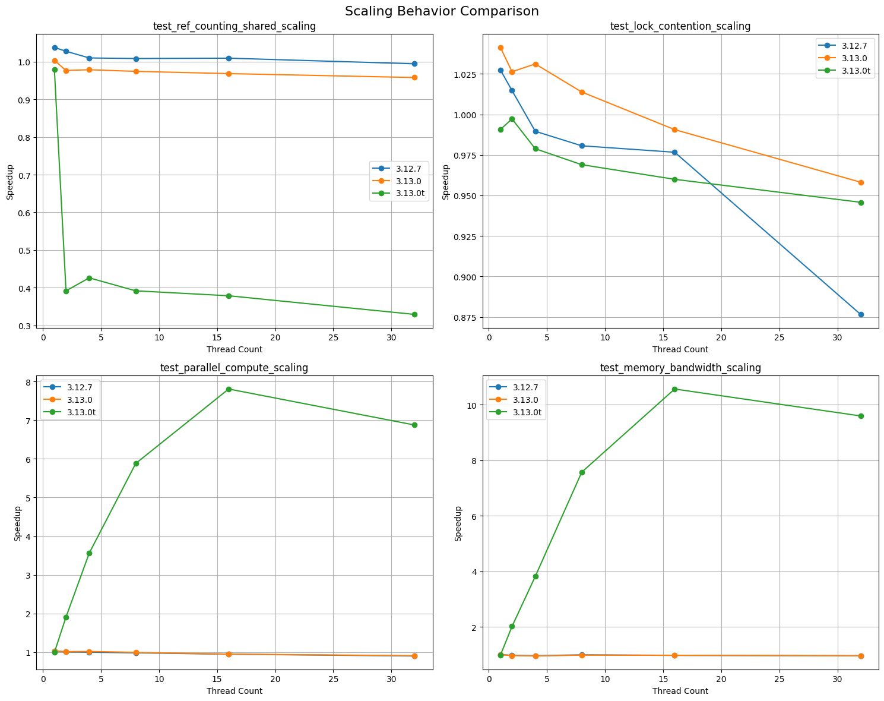
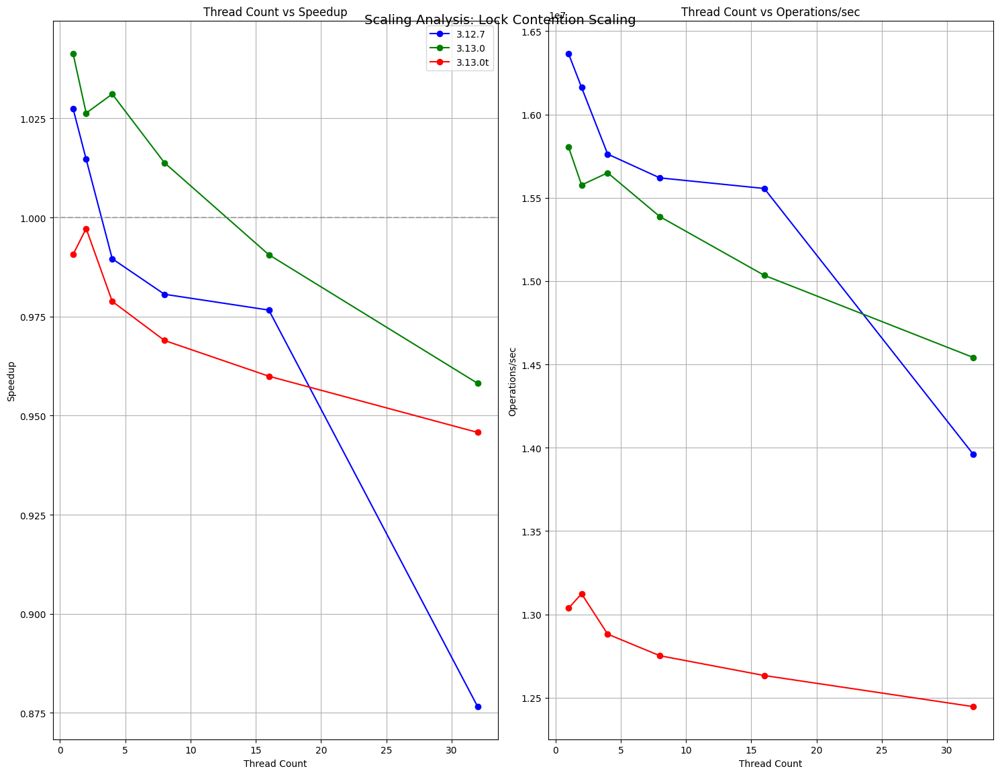
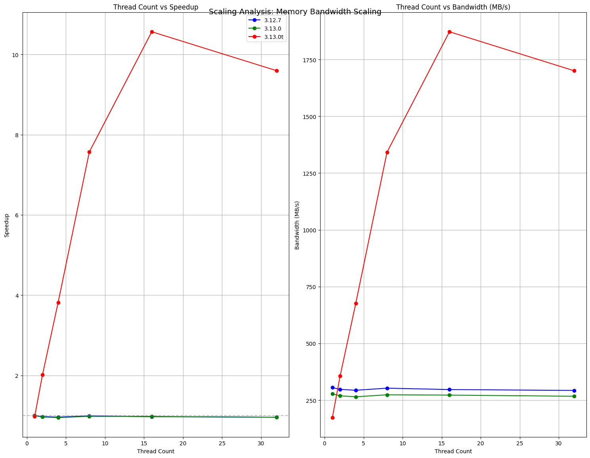
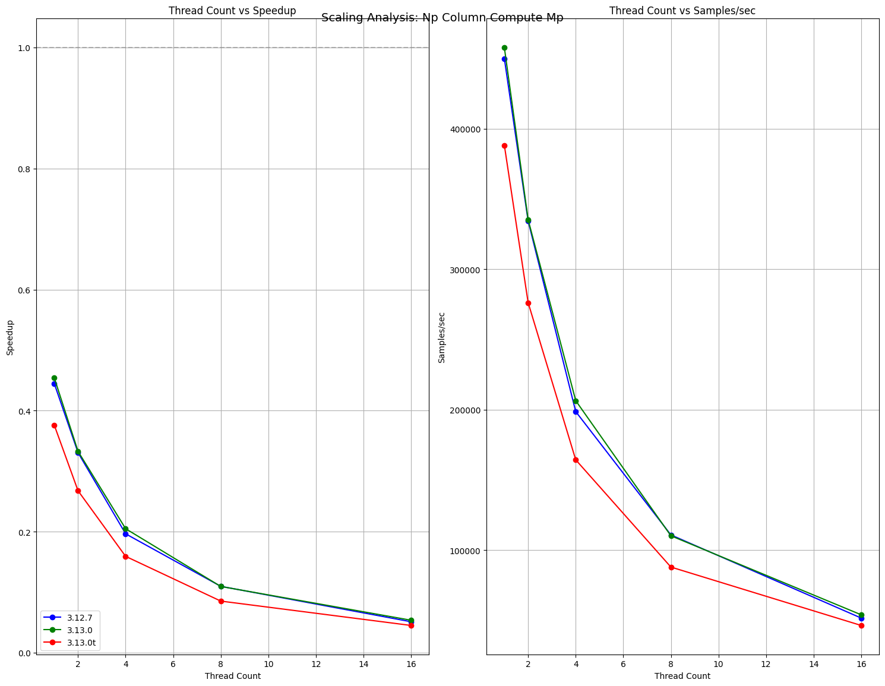
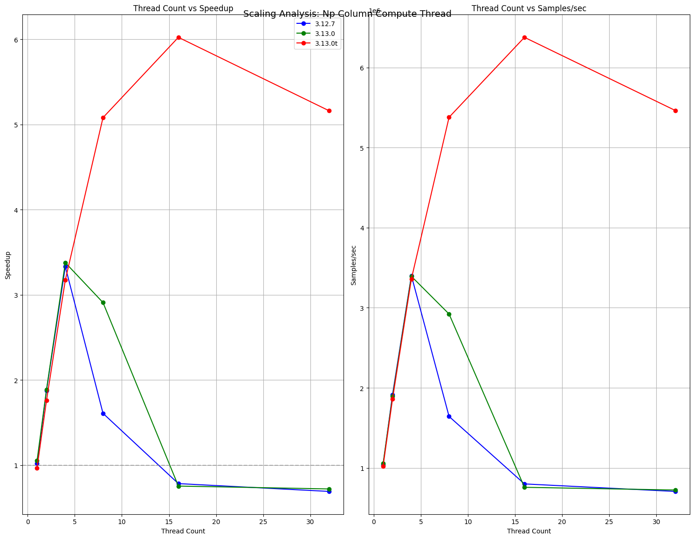
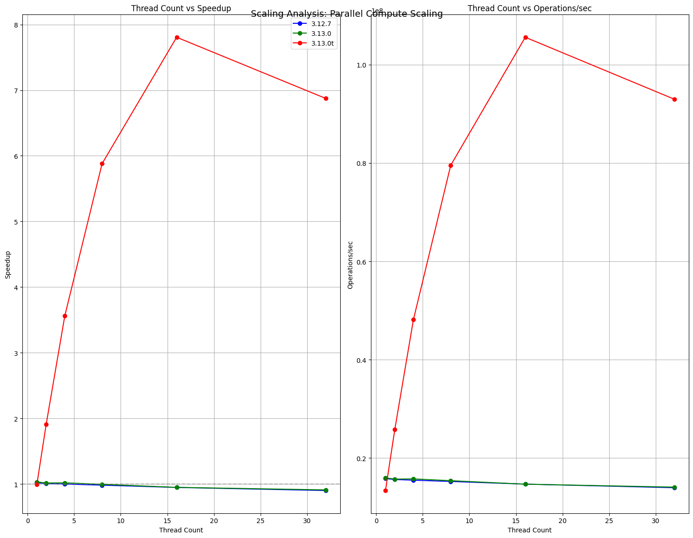
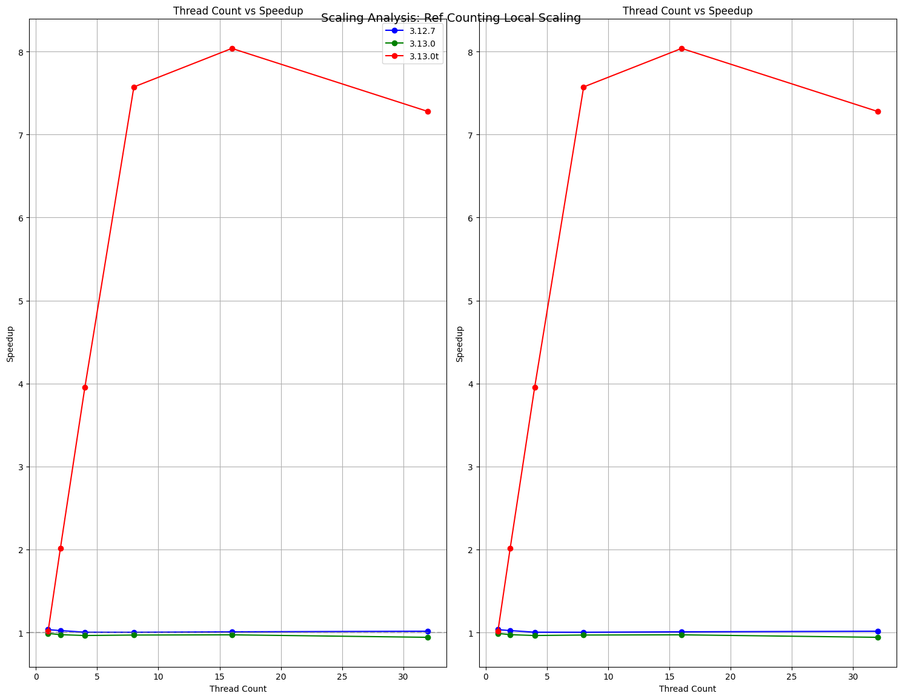
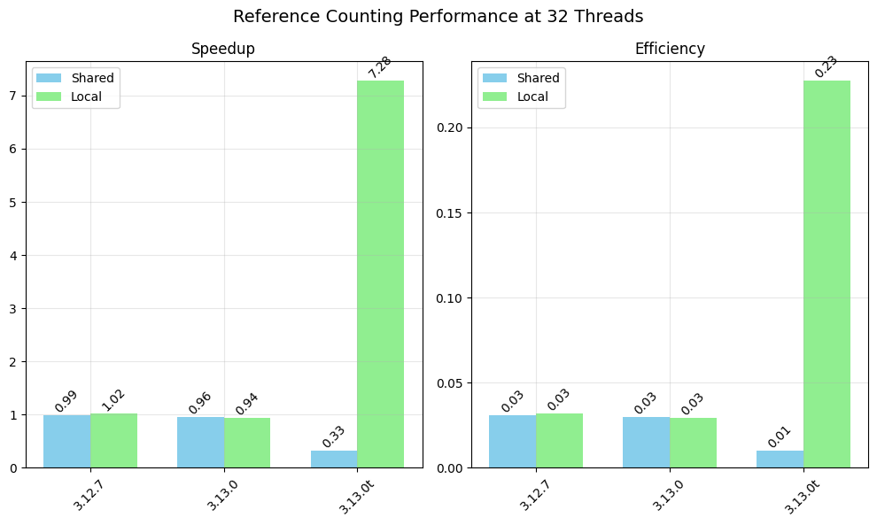

# Python Threading


```
For 30 years, Python developers faced a choice: 
> Use threads and hit the GIL wall, or use processes and hit memory/startup costs.
```
```ascii
Python Threading Evolution:
[1991]────[1994]────────[2024]────>
  │         │             │
Python    GIL          py3.13t
Created   Added     
```

## Pre-3.13 Solutions vs Python 3.13 No-GIL

Pre-3.13 Solutions - vs - Python 3.13t No-GIL
```ascii
┌─ Threading:             ┌─ True Parallelism:
|                         | [Proc1]
│ [GIL]                   │ [Thread1][Thread2][Thread3]
│   ↓                     │    ↓        ↓        ↓
│ One thread at a time    │ Direct CPU core access
│                         │
└─ Multiprocessing:       └─ 
  [Proc1]   [Proc2]   [Proc3]  
     ↓        ↓        ↓       
   CPU cores
```

or performance-critical code is written in C and explicitly releases the GIL outside of Python.

### The promise of free-threading

| Multiprocessing | True Parallelism |
|----------------|------------------|
| High process start costs | No process overhead |
| High memory overhead | Shared memory |
| IPC overhead | Lower latency |
|  | Efficient scaling |

# python 3.13t experimental

- PEP:https://peps.python.org/pep-0703/
- how-to:https://docs.python.org/3/howto/free-threading-python.html


# 

from [HPP benchmarks: pyperformance](https://anaconda.atlassian.net/wiki/spaces/HPP/pages/3936681986/Python+3.13+preview#Benchmarks):
- conda create -n py313_gil -c ad-testing/label/py313 python-gil
- conda create -n py313_nogil -c ad-testing/label/py313 python-freethreading

Finding: GIL is about the same speed as Python 3.12, free-threading is 45% slower.

| Metric          | py312 | py313_gil    | py313_nogil  |
|-----------------|-------|--------------|--------------|
| Geometric mean  | (ref) | 1.00x faster | 1.45x slower |

# threadpool benchmark on local mac system


```python
import platform, psutil

print(f"CPU: {platform.processor()}")
print(f"Physical cores: {psutil.cpu_count(logical=False)}")
print(f"Logical cores: {psutil.cpu_count(logical=True)}")
mem = psutil.virtual_memory()
print(f"Total memory: {mem.total / (1024**3):.2f} GB")

```

    CPU: arm
    Physical cores: 12
    Logical cores: 12
    Total memory: 36.00 GB


```python
import time, random
import numpy as np

def cpu_bound_task(x):
   # CPU-intensive and doesn't release the GIL
   return sum(i * i for i in range(x))


def io_bound_task(x):
   # This simulates io ops and releases the GIL
   time.sleep(random.uniform(0.001, 0.005))
   return x * 2
    

```

# 

# regular tests


```python
def create_regular_test_comparison(results_file: str) -> None:
    """Create comparison of regular test durations across Python versions"""
    
    # Load data
    with open(results_file, 'r') as f:
        results = json.load(f)['results']['regular_tests']
    
    # Prepare data
    data = []
    versions = ['3.12.7', '3.13.0', '3.13.0t']
    
    for test_name, test_data in results.items():
        row = {'test_name': test_name.replace('test_', '')}  # Remove 'test_' prefix
        for version in versions:
            if version in test_data:
                duration = test_data[version].get('duration', 0)
                row[f'{version}_duration'] = duration
                # Calculate speedup relative to 3.12.7
                if version == '3.12.7':
                    baseline_duration = duration
                    row[f'{version}_speedup'] = 1.0
                else:
                    row[f'{version}_speedup'] = baseline_duration / duration if duration else 0
            else:
                row[f'{version}_duration'] = 0
                row[f'{version}_speedup'] = 0
        data.append(row)
    
    # Create DataFrame
    df = pd.DataFrame(data)
    
    # Sort by test name
    df = df.sort_values('test_name')
    
    # Create bar plot
    fig, (ax1, ax2) = plt.subplots(2, 1, figsize=(15, 12))
    
    # Plot durations
    x = np.arange(len(df))
    width = 0.25
    
    # Duration plot
    for i, version in enumerate(versions):
        durations = df[f'{version}_duration'].fillna(0)
        bars = ax1.bar(x + i*width, durations, width, label=version)
        
        # Add value labels on top of bars
        for bar in bars:
            height = bar.get_height()
            ax1.text(bar.get_x() + bar.get_width()/2., height,
                    f'{height:.3f}s',
                    ha='center', va='bottom', rotation=45)
    
    ax1.set_ylabel('Duration (seconds)')
    ax1.set_title('Regular Test Durations by Python Version')
    ax1.set_xticks(x + width)
    ax1.set_xticklabels(df['test_name'], rotation=45, ha='right')
    ax1.legend()
    ax1.grid(True, alpha=0.3)
    
    # Speedup plot
    for i, version in enumerate(versions):
        speedups = df[f'{version}_speedup'].fillna(1.0)
        bars = ax2.bar(x + i*width, speedups, width, label=version)
        
        # Add value labels on top of bars
        for bar in bars:
            height = bar.get_height()
            ax2.text(bar.get_x() + bar.get_width()/2., height,
                    f'{height:.2f}x',
                    ha='center', va='bottom', rotation=45)
    
    ax2.set_ylabel('Speedup relative to 3.12.7')
    ax2.set_title('Regular Test Performance Relative to Python 3.12.7')
    ax2.set_xticks(x + width)
    ax2.set_xticklabels(df['test_name'], rotation=45, ha='right')
    ax2.legend()
    ax2.grid(True, alpha=0.3)
    ax2.axhline(y=1.0, color='gray', linestyle='--', alpha=0.5)
    
    plt.tight_layout()
    plt.show()
    
    # Print summary statistics
    print("\nSummary Statistics:")
    for version in versions:
        print(f"\n{version}:")
        print(f"Average Duration: {df[f'{version}_duration'].mean():.3f} seconds")
        print(f"Average Speedup: {df[f'{version}_speedup'].mean():.3f}x")
        print(f"Tests Faster than 3.12.7: {(df[f'{version}_speedup'] > 1).sum()}")
        print(f"Tests Slower than 3.12.7: {(df[f'{version}_speedup'] < 1).sum()}")


```

# regular tests comparison: plot


```python
create_regular_test_comparison('results-16c.json')
```


    

    


    
    Summary Statistics:
    
    3.12.7:
    Average Duration: 0.741 seconds
    Average Speedup: 1.000x
    Tests Faster than 3.12.7: 0
    Tests Slower than 3.12.7: 0
    
    3.13.0:
    Average Duration: 0.712 seconds
    Average Speedup: 1.050x
    Tests Faster than 3.12.7: 9
    Tests Slower than 3.12.7: 1
    
    3.13.0t:
    Average Duration: 3.290 seconds
    Average Speedup: 1.734x
    Tests Faster than 3.12.7: 3
    Tests Slower than 3.12.7: 7


Python 3.13 (with GIL):

| Operation       | Percentage | Time (µs) |
|----------------|------------|-----------|
| TLS Setup      | 73.9%      | 249.96    |
| Memory Barriers| 14.1%      | 47.69     |
| RefCount Setup | 12.0%      | 40.11     |

Total per thread: 337.76 µs

Python 3.13t (no-GIL):

| Operation       | Percentage | Time (µs) |
|----------------|------------|-----------|
| TLS Setup      | 70.5%      | 242.25    |
| Memory Barriers| 17.7%      | 60.98     |
| RefCount Setup | 11.8%      | 40.45     |

Total per thread: 343.68 µs


# Thread mgmt cost


```python
# test threading overhead - creation, lifecycle mgmt cost
import threading
def no_op_worker():
    """Thread worker that does minimal work"""
    time.sleep(0.001) 

num_threads = 1000
threads = []
for _ in range(num_threads):
    thread = threading.Thread(target=no_op_worker)
    threads.append(thread)
    thread.start()

# Wait for all threads
for thread in threads:
    thread.join()
```

 

# scaling tests


```python
import pandas as pd
import json
from typing import Dict, List

def extract_scaling_data(test_data: Dict, version: str) -> pd.DataFrame:
    """Extract scaling data for a specific version into a DataFrame"""
    scaling_data = test_data[version]['scaling_data']
    df = pd.DataFrame(scaling_data)
    
    # Extract nested metrics
    metrics_df = pd.json_normalize([d['metrics'] for d in scaling_data])
    df = pd.concat([df.drop('metrics', axis=1), metrics_df], axis=1)
    
    # Add version column
    df['version'] = version
    
    return df

def create_scaling_dfs(results_file: str) -> Dict[str, pd.DataFrame]:
    """Create separate DataFrames for each scaling test"""
    with open(results_file, 'r') as f:
        results = json.load(f)['results']['scaling_tests']
    
    scaling_dfs = {}
    versions = ['3.12.7', '3.13.0', '3.13.0t']
    
    for test_name, test_data in results.items():
        # Combine data from all versions
        dfs = []
        for version in versions:
            if version in test_data:
                df = extract_scaling_data(test_data, version)
                dfs.append(df)
        
        scaling_dfs[test_name] = pd.concat(dfs, ignore_index=True)
    
    return scaling_dfs

def analyze_scaling_tests(scaling_dfs: Dict[str, pd.DataFrame]) -> None:
    """Analyze and print scaling test results"""
    versions = ['3.12.7', '3.13.0', '3.13.0t']
    for test_name, df in scaling_dfs.items():
        print(f"\n=== {test_name} ===")
        
        # Pivot table to compare versions
        if 'bandwidth_MB_s' in df.columns:
            # Memory bandwidth test
            pivot = df.pivot_table(
                index='thread_count',
                columns='version',
                values=['bandwidth_MB_s', 'efficiency', 'speedup'],
                aggfunc='first'
            )
        elif 'refs_per_sec' in df.columns:
            # Reference counting test
            pivot = df.pivot_table(
                index='thread_count',
                columns='version',
                values=['refs_per_sec', 'efficiency', 'speedup'],
                aggfunc='first'
            )
        elif 'ops_per_sec' in df.columns:
            # Operations test
            pivot = df.pivot_table(
                index='thread_count',
                columns='version',
                values=['ops_per_sec', 'efficiency', 'speedup'],
                aggfunc='first'
            )
        elif 'samples_per_sec' in df.columns:
            # NumPy computation test
            pivot = df.pivot_table(
                index='thread_count',
                columns='version',
                values=['samples_per_sec', 'efficiency', 'speedup'],
                aggfunc='first'
            )
            
        print("\nPerformance Metrics:")
        print(pivot.round(3))
        
        # Calculate scaling factors
        print("\nScaling Factor (relative to single thread):")
        for version in versions:
            if version in df['version'].unique():
                base_perf = df[df['version'] == version].iloc[0]['speedup']
                max_perf = df[df['version'] == version]['speedup'].max()
                print(f"{version}: {max_perf/base_perf:.2f}x")

# Create and analyze scaling DataFrames
scaling_dfs = create_scaling_dfs('results-16c.json')
```


```python
pd.set_option('display.width', 1000)
pd.set_option('display.max_colwidth', None)
pd.set_option('display.expand_frame_repr', False)
pd.set_option('display.max_columns', None)
analyze_scaling_tests(scaling_dfs)
```

    
    === test_ref_counting_shared_scaling ===
    
    Performance Metrics:
                 efficiency                refs_per_sec                           speedup               
    version          3.12.7 3.13.0 3.13.0t       3.12.7       3.13.0      3.13.0t  3.12.7 3.13.0 3.13.0t
    thread_count                                                                                        
    1                 1.038  1.003   0.979  2592509.217  2799833.117  1644679.334   1.038  1.003   0.979
    2                 0.514  0.488   0.196  2567056.900  2724929.413   657673.779   1.028  0.977   0.392
    4                 0.252  0.245   0.107  2522649.877  2730414.246   715596.205   1.010  0.979   0.426
    8                 0.126  0.122   0.049  2518812.557  2718283.963   657761.240   1.008  0.974   0.392
    16                0.063  0.061   0.024  2521144.158  2701761.686   635713.088   1.009  0.968   0.379
    32                0.031  0.030   0.010  2483817.862  2672704.136   552575.296   0.994  0.958   0.329
    
    Scaling Factor (relative to single thread):
    3.12.7: 1.00x
    3.13.0: 1.00x
    3.13.0t: 1.00x
    
    === test_lock_contention_scaling ===
    
    Performance Metrics:
                 efficiency                  ops_per_sec                             speedup               
    version          3.12.7 3.13.0 3.13.0t        3.12.7        3.13.0       3.13.0t  3.12.7 3.13.0 3.13.0t
    thread_count                                                                                           
    1                 1.027  1.041   0.991  1.636463e+07  1.580430e+07  1.303717e+07   1.027  1.041   0.991
    2                 0.507  0.513   0.499  1.616196e+07  1.557669e+07  1.312332e+07   1.015  1.026   0.997
    4                 0.247  0.258   0.245  1.576184e+07  1.564963e+07  1.288125e+07   0.990  1.031   0.979
    8                 0.123  0.127   0.121  1.561921e+07  1.538669e+07  1.275167e+07   0.981  1.014   0.969
    16                0.061  0.062   0.060  1.555566e+07  1.503448e+07  1.263295e+07   0.977  0.991   0.960
    32                0.027  0.030   0.030  1.396216e+07  1.454205e+07  1.244638e+07   0.877  0.958   0.946
    
    Scaling Factor (relative to single thread):
    3.12.7: 1.00x
    3.13.0: 1.00x
    3.13.0t: 1.01x
    
    === test_parallel_compute_scaling ===
    
    Performance Metrics:
                 efficiency                  ops_per_sec                             speedup               
    version          3.12.7 3.13.0 3.13.0t        3.12.7        3.13.0       3.13.0t  3.12.7 3.13.0 3.13.0t
    thread_count                                                                                           
    1                 1.020  1.032   0.992  1.583641e+07  1.599170e+07  1.341267e+07   1.020  1.032   0.992
    2                 0.504  0.508   0.955  1.565641e+07  1.572903e+07  2.581428e+07   1.009  1.015   1.909
    4                 0.250  0.255   0.891  1.551314e+07  1.577613e+07  4.816997e+07   0.999  1.018   3.563
    8                 0.123  0.124   0.735  1.525545e+07  1.541315e+07  7.950684e+07   0.983  0.995   5.880
    16                0.059  0.059   0.488  1.471226e+07  1.470246e+07  1.055436e+08   0.948  0.949   7.806
    32                0.028  0.028   0.215  1.398498e+07  1.410078e+07  9.294651e+07   0.901  0.910   6.874
    
    Scaling Factor (relative to single thread):
    3.12.7: 1.00x
    3.13.0: 1.00x
    3.13.0t: 7.87x
    
    === test_memory_bandwidth_scaling ===
    
    Performance Metrics:
                 bandwidth_MB_s                    efficiency                speedup               
    version              3.12.7   3.13.0   3.13.0t     3.12.7 3.13.0 3.13.0t  3.12.7 3.13.0 3.13.0t
    thread_count                                                                                   
    1                   305.263  277.734   173.225      1.000  0.997   0.977   1.000  0.997   0.977
    2                   297.476  269.175   357.198      0.487  0.483   1.008   0.975  0.966   2.015
    4                   293.508  264.798   676.241      0.240  0.238   0.954   0.962  0.950   3.816
    8                   302.834  273.669  1341.652      0.124  0.123   0.946   0.993  0.982   7.570
    16                  296.672  272.230  1872.287      0.061  0.061   0.660   0.972  0.977  10.564
    32                  292.851  267.196  1700.319      0.030  0.030   0.300   0.960  0.959   9.594
    
    Scaling Factor (relative to single thread):
    3.12.7: 1.00x
    3.13.0: 1.00x
    3.13.0t: 10.81x
    
    === test_ref_counting_local_scaling ===
    
    Performance Metrics:
                 bandwidth_MB_s                    efficiency                speedup               
    version              3.12.7   3.13.0   3.13.0t     3.12.7 3.13.0 3.13.0t  3.12.7 3.13.0 3.13.0t
    thread_count                                                                                   
    1                   305.263  277.734   173.225      1.000  0.997   0.977   1.000  0.997   0.977
    2                   297.476  269.175   357.198      0.487  0.483   1.008   0.975  0.966   2.015
    4                   293.508  264.798   676.241      0.240  0.238   0.954   0.962  0.950   3.816
    8                   302.834  273.669  1341.652      0.124  0.123   0.946   0.993  0.982   7.570
    16                  296.672  272.230  1872.287      0.061  0.061   0.660   0.972  0.977  10.564
    32                  292.851  267.196  1700.319      0.030  0.030   0.300   0.960  0.959   9.594
    
    Scaling Factor (relative to single thread):
    3.12.7: 1.00x
    3.13.0: 1.00x
    3.13.0t: 7.90x
    
    === test_np_column_compute_thread ===
    
    Performance Metrics:
                 efficiency                samples_per_sec                           speedup               
    version          3.12.7 3.13.0 3.13.0t          3.12.7       3.13.0      3.13.0t  3.12.7 3.13.0 3.13.0t
    thread_count                                                                                           
    1                 1.019  1.052   0.967     1040532.682  1056377.347  1024432.683   1.019  1.052   0.967
    2                 0.938  0.942   0.879     1915460.951  1893257.621  1861495.924   1.875  1.885   1.758
    4                 0.833  0.844   0.793     3401513.296  3392351.990  3359878.239   3.330  3.377   3.173
    8                 0.201  0.364   0.635     1642795.762  2921841.867  5378829.926   1.608  2.909   5.080
    16                0.049  0.047   0.376      800372.488   758031.863  6376841.913   0.784  0.755   6.022
    32                0.022  0.023   0.161      706509.047   724150.945  5463965.713   0.692  0.721   5.160
    
    Scaling Factor (relative to single thread):
    3.12.7: 3.27x
    3.13.0: 3.21x
    3.13.0t: 6.22x
    
    === test_np_column_compute_mp ===
    
    Performance Metrics:
                 efficiency                samples_per_sec                         speedup               
    version          3.12.7 3.13.0 3.13.0t          3.12.7      3.13.0     3.13.0t  3.12.7 3.13.0 3.13.0t
    thread_count                                                                                         
    1                 0.445  0.454   0.376      449879.601  457729.047  388189.672   0.445  0.454   0.376
    2                 0.165  0.166   0.134      334244.244  335224.918  276170.892   0.331  0.333   0.268
    4                 0.049  0.051   0.040      198662.700  206427.634  164336.347   0.196  0.205   0.159
    8                 0.014  0.014   0.011      110914.033  110289.960   88031.723   0.110  0.109   0.085
    16                0.003  0.003   0.003       51729.878   54056.753   46467.790   0.051  0.054   0.045
    
    Scaling Factor (relative to single thread):
    3.12.7: 1.00x
    3.13.0: 1.00x
    3.13.0t: 1.00x


```python
# Plot scaling behavior
import matplotlib.pyplot as plt
import seaborn as sns

def plot_scaling_comparison(scaling_dfs: Dict[str, pd.DataFrame]) -> None:
    """Plot scaling behavior comparison"""
    fig, axes = plt.subplots(2, 2, figsize=(15, 12))
    fig.suptitle('Scaling Behavior Comparison', fontsize=16)
    
    for (test_name, df), ax in zip(scaling_dfs.items(), axes.flat):
        for version in ['3.12.7', '3.13.0', '3.13.0t']:
            if version in df['version'].unique():
                data = df[df['version'] == version]
                ax.plot(data['thread_count'], data['speedup'], 
                       marker='o', label=version)
                
        ax.set_title(test_name.split('/')[-1])
        ax.set_xlabel('Thread Count')
        ax.set_ylabel('Speedup')
        ax.grid(True)
        ax.legend()
        
    plt.tight_layout()
    plt.show()
```

# scaling tests summary: plots


```python
# Plot the results
plot_scaling_comparison(scaling_dfs)
```


    

    


# scaling tests details


```python
def plot_scaling_metrics(test_dfs: Dict[str, pd.DataFrame]) -> None:
    """Create detailed plots for each scaling test"""
    versions = ['3.12.7', '3.13.0', '3.13.0t']
    colors = ['blue', 'green', 'red']
    
    # Sort test names alphabetically
    sorted_tests = sorted(test_dfs.items())
    
    for test_name, df in sorted_tests:
        fig, axes = plt.subplots(1, 2, figsize=(15, 12))
        fig.suptitle(f'Scaling Analysis: {test_name.replace("test_", "").replace("_", " ").title()}', 
                    fontsize=14, y=0.95)
        
        # Plot 1: Thread Count vs Speedup
        ax = axes[0]
        for version, color in zip(versions, colors):
            if version in df['version'].unique():
                data = df[df['version'] == version]
                ax.plot(data['thread_count'], data['speedup'], 
                       marker='o', label=version, color=color)
        ax.set_title('Thread Count vs Speedup')
        ax.set_xlabel('Thread Count')
        ax.set_ylabel('Speedup')
        ax.grid(True)
        ax.legend()
        
        # Add horizontal line at y=1
        ax.axhline(y=1, color='gray', linestyle='--', alpha=0.5)

        # Plot 2: Test-specific metrics
        ax = axes[1]
        # Determine which metric to use based on test type
        if 'bandwidth_MB_s' in df.columns:
            metric, ylabel = 'bandwidth_MB_s', 'Bandwidth (MB/s)'
        elif 'refs_per_sec' in df.columns:
            metric, ylabel = 'refs_per_sec', 'References/sec'
        elif 'ops_per_sec' in df.columns:
            metric, ylabel = 'ops_per_sec', 'Operations/sec'
        elif 'samples_per_sec' in df.columns:
            metric, ylabel = 'samples_per_sec', 'Samples/sec'
        else:
            metric, ylabel = 'speedup', 'Speedup'
            
        for version, color in zip(versions, colors):
            if version in df['version'].unique():
                data = df[df['version'] == version]
                ax.plot(data['thread_count'], data[metric], 
                       marker='o', label=version, color=color)
        ax.set_title(f'Thread Count vs {ylabel}')
        ax.set_xlabel('Thread Count')
        ax.set_ylabel(ylabel)
        ax.grid(True)
        
        plt.tight_layout()
        plt.show()
        
        # Print summary statistics
        print(f"\n=== {test_name} Summary ===")
        for version in versions:
            if version in df['version'].unique():
                data = df[df['version'] == version]
                print(f"\n{version}:")
                print(f"Max Speedup: {data['speedup'].max():.2f}x")
                print(f"Max {ylabel}: {data[metric].max():.2f}")
                print(f"Scaling Efficiency: {data['efficiency'].max():.2f}")

# Create and plot the scaling test results
test_dfs = create_scaling_test_dfs('results-16c.json')

```

# scaling tests details: plot


```python
plot_scaling_metrics(test_dfs)
```


    

    


    
    === test_lock_contention_scaling Summary ===
    
    3.12.7:
    Max Speedup: 1.03x
    Max Operations/sec: 16364630.93
    Scaling Efficiency: 1.03
    
    3.13.0:
    Max Speedup: 1.04x
    Max Operations/sec: 15804303.10
    Scaling Efficiency: 1.04
    
    3.13.0t:
    Max Speedup: 1.00x
    Max Operations/sec: 13123317.07
    Scaling Efficiency: 0.99


    

    


    
    === test_memory_bandwidth_scaling Summary ===
    
    3.12.7:
    Max Speedup: 1.00x
    Max Bandwidth (MB/s): 305.26
    Scaling Efficiency: 1.00
    
    3.13.0:
    Max Speedup: 1.00x
    Max Bandwidth (MB/s): 277.73
    Scaling Efficiency: 1.00
    
    3.13.0t:
    Max Speedup: 10.56x
    Max Bandwidth (MB/s): 1872.29
    Scaling Efficiency: 1.01


    

    


    
    === test_np_column_compute_mp Summary ===
    
    3.12.7:
    Max Speedup: 0.44x
    Max Samples/sec: 449879.60
    Scaling Efficiency: 0.44
    
    3.13.0:
    Max Speedup: 0.45x
    Max Samples/sec: 457729.05
    Scaling Efficiency: 0.45
    
    3.13.0t:
    Max Speedup: 0.38x
    Max Samples/sec: 388189.67
    Scaling Efficiency: 0.38


    

    


    
    === test_np_column_compute_thread Summary ===
    
    3.12.7:
    Max Speedup: 3.33x
    Max Samples/sec: 3401513.30
    Scaling Efficiency: 1.02
    
    3.13.0:
    Max Speedup: 3.38x
    Max Samples/sec: 3392351.99
    Scaling Efficiency: 1.05
    
    3.13.0t:
    Max Speedup: 6.02x
    Max Samples/sec: 6376841.91
    Scaling Efficiency: 0.97


    

    


    
    === test_parallel_compute_scaling Summary ===
    
    3.12.7:
    Max Speedup: 1.02x
    Max Operations/sec: 15836406.75
    Scaling Efficiency: 1.02
    
    3.13.0:
    Max Speedup: 1.03x
    Max Operations/sec: 15991703.52
    Scaling Efficiency: 1.03
    
    3.13.0t:
    Max Speedup: 7.81x
    Max Operations/sec: 105543633.62
    Scaling Efficiency: 0.99


    

    


    
    === test_ref_counting_local_scaling Summary ===
    
    3.12.7:
    Max Speedup: 1.03x
    Max Speedup: 1.03
    Scaling Efficiency: 1.03
    
    3.13.0:
    Max Speedup: 0.99x
    Max Speedup: 0.99
    Scaling Efficiency: 0.99
    
    3.13.0t:
    Max Speedup: 8.04x
    Max Speedup: 8.04
    Scaling Efficiency: 1.02


    

    


    
    === test_ref_counting_shared_scaling Summary ===
    
    3.12.7:
    Max Speedup: 1.04x
    Max References/sec: 2592509.22
    Scaling Efficiency: 1.04
    
    3.13.0:
    Max Speedup: 1.00x
    Max References/sec: 2799833.12
    Scaling Efficiency: 1.00
    
    3.13.0t:
    Max Speedup: 0.98x
    Max References/sec: 1644679.33
    Scaling Efficiency: 0.98


# scaling tests details: ref counting


```python
import matplotlib.pyplot as plt
import numpy as np

def plot_ref_counting_comparison(scaling_dfs: Dict[str, pd.DataFrame]) -> None:
    """Plot reference counting comparison at max thread count"""
    
    # Get data for both ref counting tests
    shared_df = scaling_dfs['test_ref_counting_shared_scaling']
    local_df = scaling_dfs['test_ref_counting_local_scaling']
    
   
    # Filter for thread_count = 32
    shared_data = shared_df[shared_df['thread_count'] == 32]
    local_data = local_df[local_df['thread_count'] == 32]
    
    versions = ['3.12.7', '3.13.0', '3.13.0t']
    
    # Determine which metrics are available
    available_metrics = set(shared_df.columns) & set(local_df.columns)
    
    # Select metrics that exist in both dataframes
    metrics = []
    for metric in ['refs_per_sec', 'objects_per_sec', 'speedup', 'efficiency']:
        if metric in available_metrics:
            metrics.append(metric)
    
    # Set up the plot
    fig, axes = plt.subplots(1, len(metrics), figsize=(5*len(metrics), 6))
    if len(metrics) == 1:
        axes = [axes]
    fig.suptitle('Reference Counting Performance at 32 Threads', fontsize=14)
    
    width = 0.35  # Width of bars
    x = np.arange(len(versions))
    
    for idx, metric in enumerate(metrics):
        ax = axes[idx]
        
        try:
            # Get values with error handling
            shared_values = []
            local_values = []
            for v in versions:
                shared_val = shared_data[shared_data['version'] == v][metric].iloc[0] if not shared_data[shared_data['version'] == v].empty else 0
                local_val = local_data[local_data['version'] == v][metric].iloc[0] if not local_data[local_data['version'] == v].empty else 0
                shared_values.append(shared_val)
                local_values.append(local_val)
            

            # Create bars
            ax.bar(x - width/2, shared_values, width, label='Shared', color='skyblue')
            ax.bar(x + width/2, local_values, width, label='Local', color='lightgreen')
            
            # Customize plot
            ax.set_title(f'{metric.replace("_", " ").title()}')
            ax.set_xticks(x)
            ax.set_xticklabels(versions, rotation=45)
            ax.legend()
            ax.grid(True, alpha=0.3)
            
            # Add value labels on top of bars
            for i, v in enumerate(shared_values):
                ax.text(i - width/2, v, f'{v:.2f}', ha='center', va='bottom', rotation=45)
            for i, v in enumerate(local_values):
                ax.text(i + width/2, v, f'{v:.2f}', ha='center', va='bottom', rotation=45)
                
        except Exception as e:
            print(f"\nError plotting {metric}:", str(e))
    
    plt.tight_layout()
    plt.show()
```

# scaling tests details: ref counting plot


```python
plot_ref_counting_comparison(scaling_dfs)
```


    

    


```python

```


```python

```
